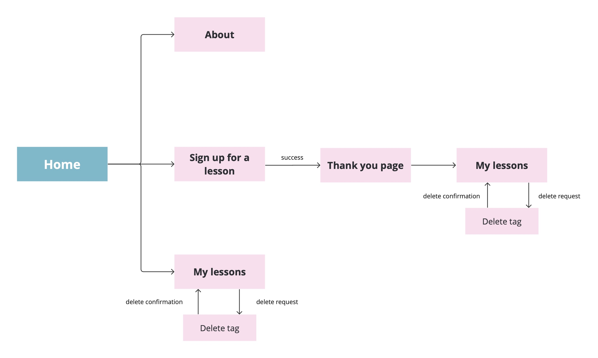
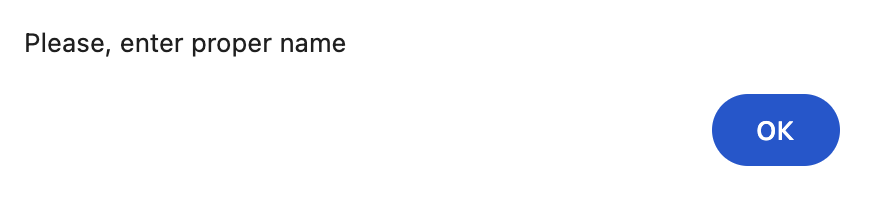
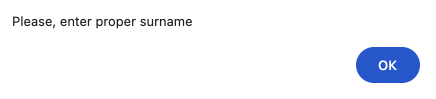
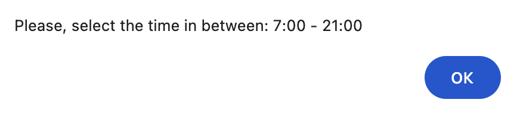
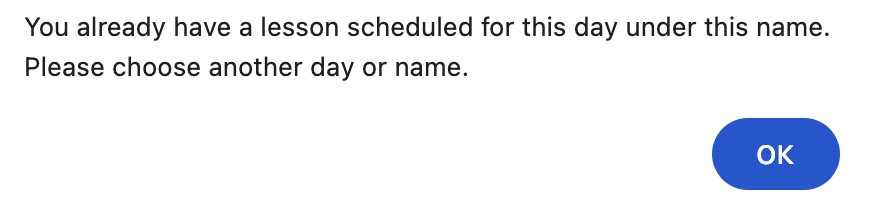
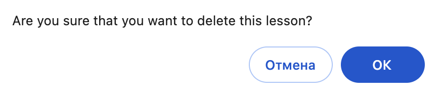

### 1. Page flow diagram

### 2. Usage scenario

**The user can expect different types of scenarios during filling out the form for the lesson.**

* The form checks for mandatory input of the name, surname, mail and date of the lesson. If at least one of the fields is not filled in, a notification will appear called with the built-in validation attribute "required". 
* There is a check for entering the name and surname only in alphabetic characters, otherwise the following notifications will be triggered.

  
* There is a check for entering the time, ensuring it's between 07:00 and 21:00. Otherwise the following notification will be triggered.

* There is a check in case one student tries to enroll more than once in a day, otherwise the following notification will be triggered.

**The user may also encounter a warning notification in case of deleting the lesson.**

